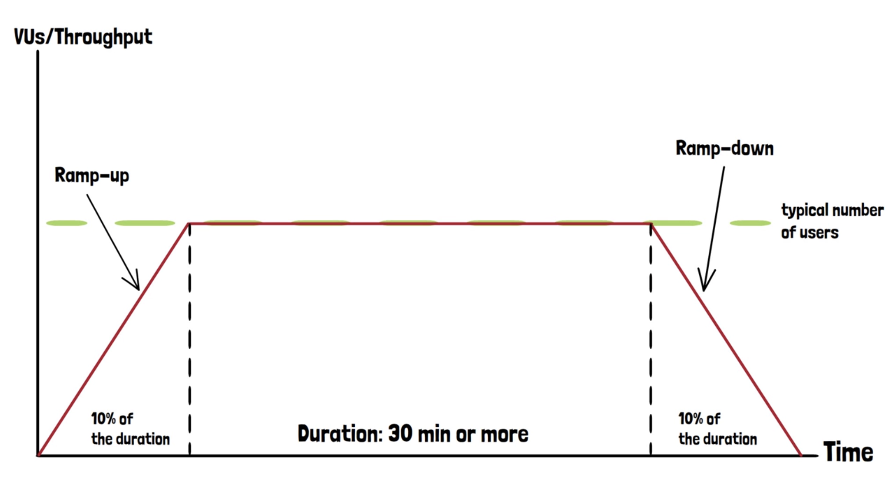

# Load Test Methodology

Load testing evaluates an application under typical usage conditions to assess its performance and stability. The term "typical load" varies based on the application. For example, when testing a bridge, the load test would simulate traffic conditions up to its designed capacity, such as the number of vehicles expected during peak rush hours.

Similarly, in software applications, the "typical load" refers to the number of concurrent users the application can handle during its busiest periods. This value should be derived from empirical data whenever possible. For instance, if an application regularly handles 300 concurrent users during peak hours, this number should serve as the baseline for load testing.

In cases where empirical data is unavailable (e.g., if the application has not yet been launched), an estimation of expected user traffic should be made.

## Sustained Load Testing

A key aspect of load testing is evaluating the application over a prolonged period. Short tests, lasting only a few minutes, may not be sufficient to reveal potential issues that occur during sustained usage. Therefore, it is common to run load tests for at least 30 minutes or longer. This allows time to identify problems that may arise only after the application has been under load for some time.

## Gradual User Increase

In real-world scenarios, user traffic fluctuates over time; it does not typically surge all at once. As such, load tests should simulate this by gradually increasing the number of users. This mimics real-world behavior and allows for more accurate testing of how the application scales its resources. Many applications rely on auto-scaling features, and a sudden spike in users may prevent these mechanisms from kicking in properly.

## Typical Load Test Structure



A typical load test consists of three stages:

1. **Ramp-up Stage**:

    During this phase, the number of users is gradually increased until the target value is reached. This helps simulate a real-world scenario where user traffic slowly builds up. For a 30-minute test, a ramp-up time of approximately 5 minutes (around 10% of the total test duration) is recommended. For longer tests, such as 90 minutes, the ramp-up time can be reduced slightly, but it should still provide adequate time for the system to scale.

2. **Sustained Load Stage**:

    Once the desired load is reached, the application is maintained at that load for an extended period. This allows the system to operate under typical conditions, providing a clearer picture of how it behaves under sustained stress.

3. **Ramp-down Stage**:

    As with the ramp-up phase, users should be gradually reduced in the ramp-down phase. This helps test the system’s ability to gracefully scale down its resources as user demand decreases. Abruptly stopping the test without a ramp-down phase fails to assess the application's resource deallocation mechanisms.


## Importance of Ramp-up and Ramp-down Phases

Both the ramp-up and ramp-down periods are critical for identifying early signs of application weakness. The ramp-up phase may highlight issues as the application scales up, while the ramp-down phase ensures the system can handle decreasing loads smoothly. For realistic results, both phases should be of similar duration.

# Setting Up a Load Test in K6

In this section, we will walk through setting up a load test in k6 using the stages configuration. This approach allows us to gradually ramp up traffic, sustain it at a defined level, and then ramp it down, simulating a real-world load pattern. The following code example demonstrates this:

```javascript
import http from "k6/http";
import { sleep } from "k6";

// Configuration for the load test
export const options = {
    stages: [
        // Ramp-up: 10 users over 10 seconds
        { duration: "10s", target: 10 },
        // Steady state: 10 users for 30 seconds
        { duration: "30s", target: 10 },
        // Ramp-down: decrease to 0 users over 10 seconds
        { duration: "10s", target: 0 },
    ],
};

// Test script
export default function () {
    http.get("<https://test.k6.io>");
    sleep(1);
    http.get("<https://test.k6.io/contacts.php>");
    sleep(1);
    http.get("<https://test.k6.io/news.php>");
    sleep(1);
}
```

## Explanation of the Test Setup

The load test defined above contains three distinct stages:

1. **Ramp-up**: Over the first 10 seconds, k6 will gradually increase the load from 0 to 10 virtual users (VUs).
2. **Steady State**: The load will remain constant at 10 VUs for the next 30 seconds.
3. **Ramp-down**: Over the final 10 seconds, the load will decrease back to 0 VUs.

This configuration is useful for simulating real-world traffic patterns, where user activity tends to gradually increase, stay consistent for a period, and then taper off.

## Key Elements of k6 Load Tests

- **Stages**: The `stages` array allows us to define multiple phases of the test, each with a specific duration and target number of users.
- **Duration**: Specifies how long each stage will last (e.g., "30s" for 30 seconds).
- **Target**: The number of virtual users k6 should ramp up to or sustain during each stage.

By using stages, you can simulate realistic traffic patterns, avoiding sudden spikes that could distort the test results or overwhelm the system under test.

## Best Practices for Load Testing

1. **Gradual Load Increase**: When testing an application, it is advisable to start with a lower load and gradually increase it. For instance, if the goal is to handle 300 users, start with 50 users, then increase to 100, 150, 200, and so on. This approach allows you to collect valuable performance data incrementally.
2. **Pre-production Environment**: Load tests should be run in a pre-production environment that mimics the production setup as closely as possible. Running load tests directly in production can degrade performance for actual users.
3. **Scaling Infrastructure**: Load tests help assess whether your infrastructure can handle the expected traffic. Collaborate with your infrastructure team to monitor the test and ensure that systems scale as required.
4. **Monitor for Regressions**: Load tests should be part of routine testing, especially after infrastructure changes or before deploying new application versions. Always ensure the system performs at least as well as previous versions to avoid regressions.

## Avoiding Excessive Load

It is important to note that load testing should not overwhelm an application. The goal is to simulate realistic traffic, not to crash the system. As shown in the example, this can be done by using smaller user counts and gradually increasing traffic while monitoring the system's response.

[Average-load testing: A beginner's guide | Grafana Labs](https://grafana.com/blog/2024/01/30/average-load-testing/)