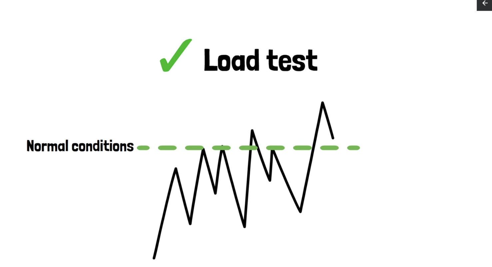
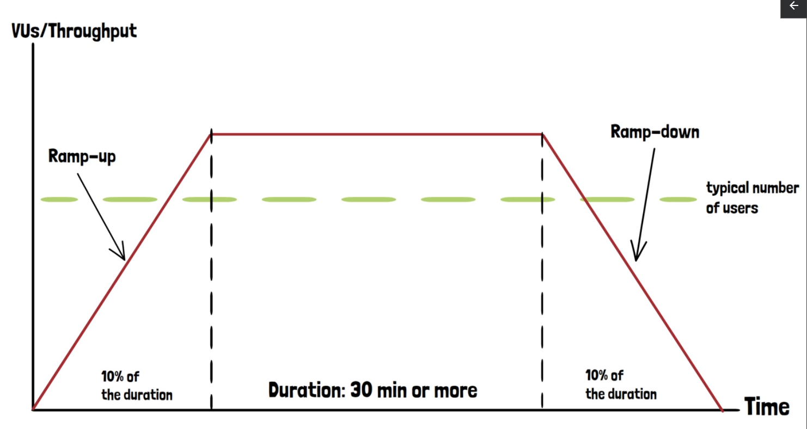

# Stress Testing Methodology



Stress testing is a critical process that helps evaluate how an application performs under extreme conditions, beyond
its normal operational capacity. Once load testing has been completed, and the application performs within acceptable
limits, it’s essential to examine its behavior under heavier-than-usual loads. This is where **stress testing** comes
into play.

## What is Stress Testing?

A stress test simulates a situation where the application experiences an above-average load, pushing it beyond its
standard operating conditions. This method is akin to testing the structural integrity of a bridge by having the
heaviest vehicles drive across it. The fundamental structure of a stress test closely resembles a load test; however,
the key distinction is the significantly higher load applied.



## Why Conduct Stress Tests?

Stress testing is useful for understanding the application’s performance under demanding conditions. For instance, in
the context of an online shopping platform, periods such as Black Friday represent times when the application must
handle a far greater number of users than during regular periods.

## Defining the Load Increase

The extent of the load increase during stress testing can vary. There’s no fixed rule regarding how much additional load
to apply. It could range from 20% to 100% or more, depending on the specific context and historical data. Ideally, the
increase should be informed by empirical data, such as user activity trends from previous years, to make predictions for
the current or upcoming year.

## Observing Performance

During stress testing, the application may either perform well or exhibit degraded performance. It’s crucial to define
what constitutes acceptable performance degradation. Collaboration with the business side is vital to set these limits.
Another important factor to monitor is the **ramp-down stage**, when the test load is gradually reduced.

For instance, if the application’s performance starts to degrade during the test, it may not be immediately concerning
if the degradation is minor. However, it’s essential to observe whether the application can recover as the load is
reduced. In some cases, degraded performance may persist, preventing the application from returning to normal even after
the test concludes. Successful recovery during the ramp-down stage is a key indicator of the application's resilience.

# Stress Test Implementation in k6

When performing stress testing in k6, the process closely follows that of a load test. The primary difference lies in
the increased user load applied during the test. Below is an example of how to configure and run a basic stress test
using k6.

## Stress Test Configuration Example

```jsx
import http from "k6/http";
import {sleep} from "k6";

// Stress test configuration
export const options = {
    stages: [
        // Ramp-up stage: Gradually increase to 20 users over 10 seconds
        {duration: "10s", target: 20},

        // Steady-state stage: Maintain 20 users for 30 seconds
        {duration: "30s", target: 20},

        // Ramp-down stage: Decrease to 0 users over 10 seconds
        {duration: "10s", target: 0},
    ],
};

export default function () {
    // Execute a series of HTTP GET requests with a 1-second pause between each
    http.get("<https://test.k6.io>");
    sleep(1);
    http.get("<https://test.k6.io/contacts.php>");
    sleep(1);
    http.get("<https://test.k6.io/news.php>");
    sleep(1);
}
```

## Key Points for Stress Testing

1. **Reusing Load Test Configurations**: A stress test can be built on the foundation of a load test. The same stages
   and structure are used, but with a higher number of virtual users. For instance, if a load test involves 100 users, a
   stress test might scale that up to 1000 users.
2. **Realistic Load Values**: When increasing the load for a stress test, it is essential to keep the target number of
   users realistic. Start with a moderate increase, such as 10% or 20%, and gradually build up to larger increments,
   such as 50% or 100%. This approach allows you to gather meaningful data on how the application performs under
   different load levels.
3. **Gradual Scaling**: Avoid sudden spikes in user load. Gradually increasing the load helps you understand how the
   application behaves under progressively higher demands, allowing for smoother testing and clearer insights.
4. **Execution Process**: The process of defining stages, ramping up, maintaining a steady state, and ramping down is
   identical between stress and load tests in k6. Therefore, no changes in the structure of the test are necessary, only
   the values for the user load.

### Sample Stage Configurations

- **Ramp-up**: Gradually increase the number of users to simulate real-world scaling scenarios.
    - Example: `{ duration: "5m", target: 1000 }` gradually increases the load to 1000 users over 5 minutes.
- **Steady State**: Maintain a fixed number of users for an extended period.
    - Example: `{ duration: "30m", target: 1000 }` keeps 1000 users for 30 minutes.
- **Ramp-down**: Gradually reduce the number of users back to zero to observe the application’s recovery behavior.
    - Example: `{ duration: "5m", target: 0 }` decreases the user load to zero over 5 minutes.

## Conclusion

Stress tests should be run only after a successful load test, as their purpose is to evaluate application performance
under conditions exceeding normal user traffic. Monitoring how the application handles such loads helps identify its
capacity and potential failure points under high demand.

[Stress testing: A beginner's guide | Grafana Labs](https://grafana.com/blog/2024/01/30/stress-testing/)