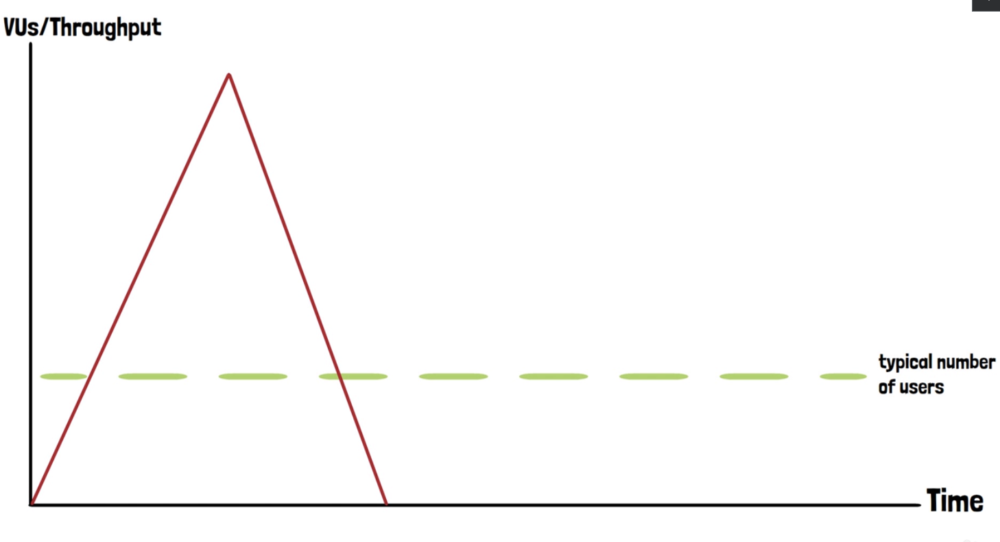

# Spike Testing Methodology

## Spike Testing in k6

In real-world scenarios, applications may face sudden spikes in user traffic, whether expected or unexpected. Events
like product launches, promotions, social media mentions, or high-audience TV commercials can lead to a sudden influx of
users that significantly exceeds the normal load. To assess how well an application can handle such situations, **spike
testing** is conducted.

## What is Spike Testing?

Spike testing simulates an extreme and abrupt increase in user load, far beyond typical traffic levels, within a very
short time frame. Imagine it as dropping a heavy truck from a plane onto a bridge: the bridge (your application)
experiences a sudden, massive impact. The purpose of this test is to evaluate how well the application copes with this
rapid surge in demand.



## Why Spike Testing is Important

There are several scenarios where spike testing becomes crucial:

- A sudden mention of your product or service by a well-known personality.
- The release of a new feature or product.
- A major advertisement aired during peak viewing hours.

In these cases, the number of users interacting with the application will dramatically increase within moments. The
spike may not only be unprecedented but could also surpass the levels defined during typical stress tests.

## Application Behavior During a Spike

When an application is running under normal conditions, it handles a steady, manageable number of users. However, during
a spike, the number of users increases abruptly, pushing the load far beyond the usual capacity. This sudden spike can
happen so quickly that there is almost no ramp-up time.

It’s important to note that while many users might access the application during the spike, not all of them will stay
for long periods. This means that certain parts of the system could experience more load than others, depending on how
users interact with the application.

## Defining the Spike Test Scenario in k6

Unlike other types of load testing, where the load ramps up gradually, a spike test involves an immediate surge in user
traffic. This requires configuring the test scenario differently in k6. The key is to simulate a rapid and steep
increase in virtual users (VUs) to reflect the sudden spike.

For more detailed insights and practical implementation of spike testing with k6, refer
to [Grafana’s official guide on spike testing](https://grafana.com/blog/2024/01/30/spike-testing/#spike-testing-in-k6).

# Spike Testing with k6

Spike tests are essential for simulating scenarios where an application experiences a sudden and massive influx of users
within a very short period. This type of load test is critical for assessing how well your system can handle rapid
traffic spikes, such as those caused by TV commercials, viral social media events, or product launches. In this section,
we will explore how to configure a spike test using the k6 framework.

## Code Example: Spike Test in k6

Below is an example of a basic spike test configuration:

```jsx
import http from "k6/http";
import {sleep} from "k6";

// Load test configuration
export const options = {
    stages: [
        {duration: "2m", target: 10000}, // Ramp up to 10,000 users over 2 minutes
        {duration: "1m", target: 0},     // Ramp down to 0 users over 1 minute
    ],
};

export default function () {
    http.get("<https://test.k6.io>");
    sleep(1);
}
```

## Explanation of the Spike Test

A spike test differs from typical load or stress testing scenarios. Instead of gradually increasing the number of
virtual users (VUs), the spike test simulates a rapid surge in traffic. In the example above, the number of users jumps
from zero to 10,000 within just two minutes, followed by an immediate drop back to zero users in one minute.

This mirrors real-world events where, for example, a sudden influx of users may occur within seconds due to external
factors like:

- A product being mentioned by a high-profile influencer.
- A TV commercial aired during peak hours.
- The announcement of a major sale or event.

The key to a spike test is the immediate ramp-up time and the steep ramp-down. Users will flood the application,
typically interacting with only a few core sections of the system, such as the home page or landing page, before
leaving.

## Customizing the Spike Test

While the above example demonstrates a simple spike test with just two stages, it’s possible to configure more complex
test scenarios. For instance, you could simulate regular traffic followed by a sudden spike. This allows for more
realistic testing of an application under normal load before a spike occurs.

Additionally, spike tests can be customized based on user behavior. In real-world scenarios, not all users will navigate
through multiple pages of an application. For example:

- Most users might only visit the main page.
- A smaller percentage will explore product pages.
- An even smaller fraction will proceed to purchase.

These behaviors can be simulated by incorporating logic into the test script, distributing users across different
sections of the application based on probabilities. For instance, 5% of the users could be directed to product pages,
and only a fraction of those might initiate a purchase.

## Defining a Realistic Spike Value

Determining an appropriate spike value can be challenging. As a general rule of thumb, a good starting point is to set
the spike traffic to **four times** the value used in your stress test. However, depending on your application's usage
patterns and traffic projections, you may need to adjust this value higher or lower.

## System Behavior and Recovery

It’s important to understand that during a spike test, you may anticipate parts of the system to fail due to the
overwhelming load. This is not an unusual outcome and provides valuable insights into the system's robustness. Key
points to monitor include:

- **Automatic recovery**: Can the system recover from failure on its own, or does it require manual intervention?
- **Recovery time**: How long does it take for the system to stabilize after the load decreases?

Understanding these aspects is crucial for planning post-failure recovery processes.

## Conclusion

Running a spike test is not a regular part of your deployment process, but it is a valuable test to perform when you
expect a sudden surge in traffic. This could be due to marketing campaigns, product launches, or media exposure. For
organizations anticipating such events, spike testing ensures that the infrastructure is ready to handle sudden, intense
loads.

If such scenarios are unlikely for your application, running a spike test may not be necessary. However, if you foresee
a traffic surge or want to validate the robustness of your system, spike testing with k6 can provide critical insights
into how your application performs under extreme conditions.