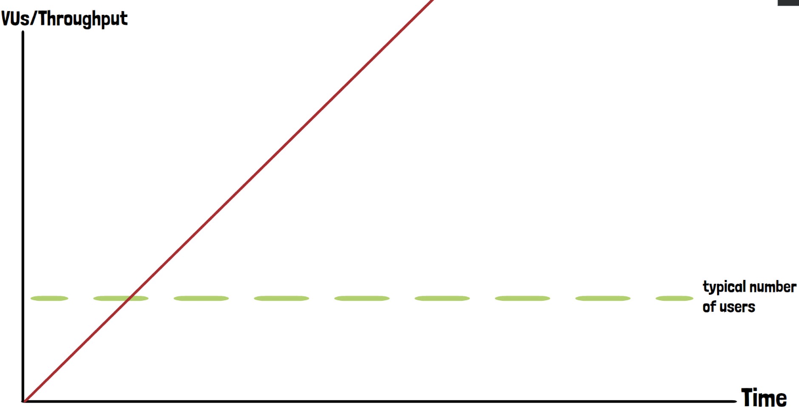

A **breakpoint test** is designed to assess the maximum load that an application can handle before it fails. This test
gradually increases the load until the application either crashes or becomes unresponsive. The goal is to identify the
point at which performance degradation or errors occur, which helps gauge the system's capacity and stability.

## Concept of Breakpoint Testing

In a breakpoint test, we simulate a continuously increasing load over time, monitoring how the application behaves under
extreme conditions. The test starts with a minimal load and scales up indefinitely (or until the application breaks).
The point at which the system starts to fail, either by producing errors or by becoming unresponsive, is known as the *
*breakpoint**.

The process is comparable to testing the structural integrity of a bridge: adding load until it collapses. Similarly, in
a breakpoint test, the load continues to increase until the application cannot handle it anymore.



## Configuration Example

Below is a k6 configuration for a basic breakpoint test. The test runs for 2 hours, gradually increasing the number of
virtual users to 100,000.

```jsx
import http from "k6/http";
import {sleep} from "k6";

// Configuration for a breakpoint test
export const options = {
    stages: [
        {duration: "2h", target: 100000}, // Gradually increase to 100,000 users over 2 hours
    ],
};

export default function () {
    http.get("<https://test.k6.io>");
    sleep(1);
}
```

In this scenario, we simulate a high number of users (100,000), far exceeding typical usage patterns. While the duration
of this test is set to 2 hours, there is no predefined stopping point. The test must be actively monitored to detect
when the application starts to break.

## Monitoring and Stopping the Test

Because a breakpoint test pushes the system to its limits, there are no fixed success criteria. Instead, testers need to
observe the application's behavior and manually stop the test once they notice severe performance issues, such as:

- A high error rate
- Excessive response times
- The application becoming completely unresponsive

In k6, real-time monitoring of metrics is limited during the test run. The CLI does not provide real-time feedback for
such long-running tests, so manual intervention is required to stop the test when the system starts to fail. After
stopping the test (using `Ctrl+C`), k6 generates a report with the results up to that point.

For advanced monitoring, k6 allows exporting metrics to a file or streaming them to an external monitoring system (e.g.,
Grafana), which provides real-time insights. However, setting up this type of monitoring is outside the scope of this
basic introduction.

## Considerations for Running Breakpoint Tests

1. **Environment**: Breakpoint tests should not be run in a production environment unless explicitly testing autoscaling
   capabilities. Autoscaling infrastructure can potentially prevent the application from crashing, but it is essential
   to define limits on how much the system is allowed to scale.
2. **Cloud Infrastructure**: Cloud environments often have elastic scaling, meaning they can dynamically adjust
   resources to meet demand. However, such scaling comes with cost implications. When running breakpoint tests in cloud
   environments, ensure that budget constraints and scaling limits are defined.
3. **Sequential Testing**: Before conducting a breakpoint test, it is recommended to complete a **load test** and a *
   *stress test**. These tests ensure the application performs well under expected loads and gradually increasing stress
   levels before pushing it to its maximum limit in a breakpoint test.

## Conclusion

Breakpoint testing is a crucial method for determining the maximum capacity of an application. However, it should be
used judiciously, and never on production systems unless absolutely necessary. This type of test provides valuable
insights for capacity planning and infrastructure optimization, especially for applications running in cloud
environments.

For more information on breakpoint testing, you can refer to
the [Grafana blog post](https://grafana.com/blog/2024/01/30/breakpoint-testing/).