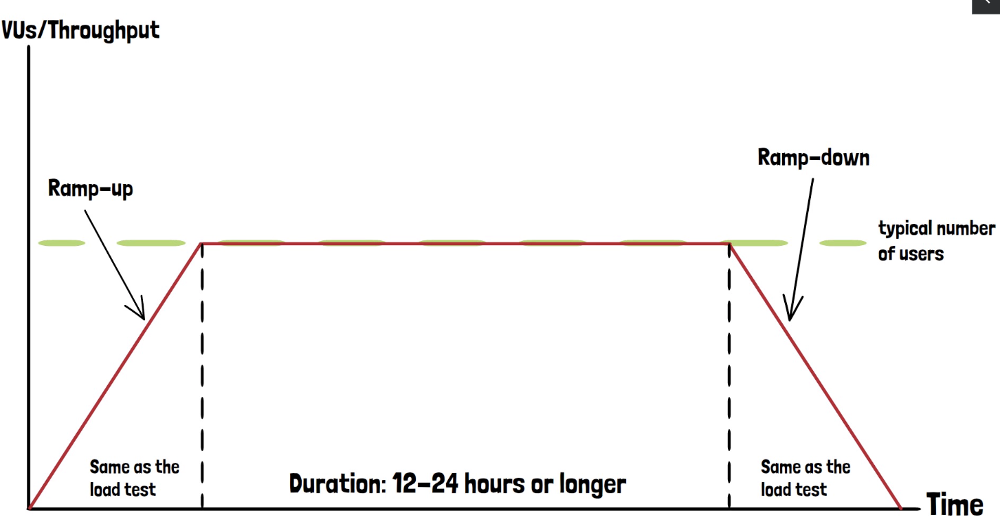

A soak test, also known as an endurance test, is a type of load test where the application is subjected to a sustained
load for an extended period. The primary goal is to observe how the system behaves under prolonged usage, which helps
detect issues that may not manifest during shorter load tests.



## Key Differences from Standard Load Tests

- **Duration**: While a typical load test might run for minutes or a few hours, a soak test extends over several hours
  or even days.
- **Purpose**: Load tests evaluate system performance under normal usage scenarios, while soak tests aim to uncover
  issues that occur over time, such as memory leaks, disk space exhaustion, or service crashes.

## Common Issues Identified by Soak Tests

1. **Memory Leaks**: A program may hold onto memory it no longer needs, causing the system to slow down or even crash
   once available memory is exhausted.
2. **Disk Space Exhaustion**: As logs, database entries, or caches accumulate, the system may run out of storage,
   affecting performance or causing failures.
3. **Service Crashes**: Some services may fail unpredictably after running for a long time, leading to outages or
   degraded performance.

## k6 Soak Test Configuration

Below is an example of configuring a soak test in the k6 framework:

```jsx
import http from "k6/http";
import {sleep} from "k6";

// Setting configuration for the soak test
export const options = {
    stages: [
        // Ramp-up stage
        {duration: "5m", target: 1000}, // Ramp up to 1000 users over 5 minutes
        // Steady state stage
        {duration: "24h", target: 1000}, // Maintain 1000 users for 24 hours
        // Ramp-down stage
        {duration: "5m", target: 0}, // Ramp down to 0 users over 5 minutes
    ],
};

export default function () {
    http.get("<https://test.k6.io>");
    sleep(1);
    http.get("<https://test.k6.io/contacts.php>");
    sleep(1);
    http.get("<https://test.k6.io/news.php>");
    sleep(1);
}
```

## Test Stages Explained

1. **Ramp-Up Stage**: Over 5 minutes, the number of virtual users (VUs) increases to 1000. This simulates a gradual
   increase in load.
2. **Steady State Stage**: The system maintains 1000 VUs for 24 hours, simulating prolonged, constant load on the
   application.
3. **Ramp-Down Stage**: The load gradually decreases over 5 minutes as VUs drop to zero.

## Why Run a Soak Test?

- **Memory Management**: Detect issues like memory leaks that only appear after sustained usage.
- **Storage Considerations**: Monitor if logs, caches, or database entries grow to the point of filling disk space.
- **Stability**: Ensure services don’t unexpectedly crash or degrade after extended operation.

## Best Practices for Running Soak Tests

1. **Pre-Requisite**: Always conduct a load test first to ensure the system can handle shorter periods of stress.
   Running a soak test without passing a load test can result in wasted time if the application fails in the initial
   phase.
2. **Extended Duration**: The steady state duration can be adjusted depending on testing needs. It can run for 8 hours,
   12 hours, or even several days if necessary.
3. **Monitor System Behavior**: Observe how the application behaves over time, focusing on performance degradation,
   memory usage, disk space, and stability.

## Conclusion

A soak test is essential for identifying long-term issues that are often missed in short-duration load tests. It
provides a more realistic simulation of how the application will perform under continuous usage, revealing issues like
memory leaks, disk space consumption, and service instability. Always run soak tests after successfully completing
shorter load tests to ensure the system is capable of handling the load.