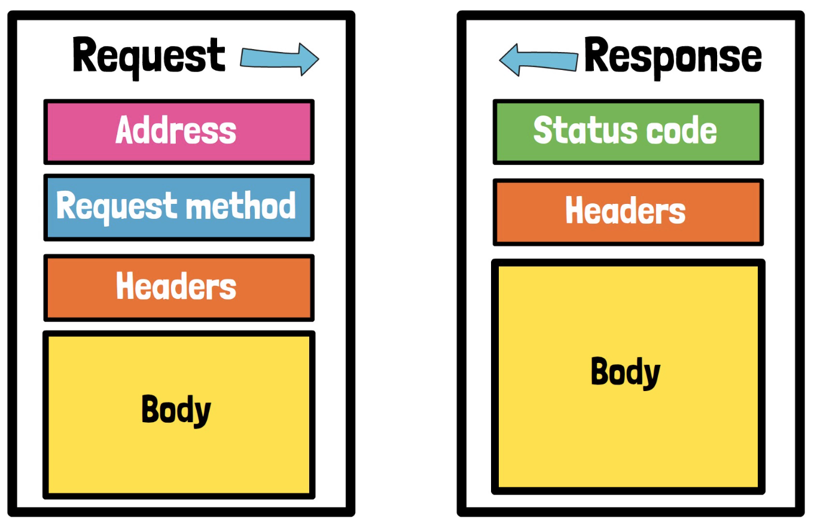

## Browser and Server Interaction

When we open a browser and navigate to a website like [**TestCase6.com**](http://testcase6.com/), a communication
exchange occurs between the browser and the server hosting the website. This exchange involves two key steps:

1. **Request**: The browser sends a message (called a request) to the server, essentially asking for the webpage by
   saying, “Give me this page.”
2. **Response**: The server receives the request, processes it, and sends back a message (called the response)
   containing the requested webpage.

This interaction is facilitated by the **HTTP (Hypertext Transfer Protocol)**, which allows the client (the browser) and
the server (which hosts the website) to communicate by following a set of predefined rules.

## What is HTTP?

**HTTP** is a protocol, or a set of rules, that ensures successful communication between two systems—in this case, the
browser and the web server. Most websites and APIs use HTTP, so it's essential to understand its basics to interact with
web applications effectively when using tools like **k6**.

In a **k6** script, you will often see addresses that start with **https://**. The **"s"** stands for **secure**,
meaning the connection is encrypted. Though we may casually refer to the protocol as **HTTP**, it is important to use
the secure version (**HTTPS**) whenever possible to ensure that data exchanged between the client and server is
protected from unauthorized access.

## HTTP Messages Breakdown

Let’s break down the components of **HTTP messages** for a clearer understanding.

1. **Request**:
    - Contains:
        - **Address**: The URL of the resource being requested.
        - **Request Method**: Specifies the action the client wants the server to take (e.g., GET, POST).
        - **Headers**: Additional information like authentication details or content type.
        - **Body**: The actual data being sent (optional in some request types like GET).
2. **Response**:
    - Contains:
        - **Status Code**: Indicates whether the request was successful (e.g., 200 OK, 404 Not Found).
        - **Headers**: Information such as content type and server details.
        - **Body**: The data returned from the server, often the content of the requested page.

## Analogy: HTTP as a Postal Letter

To simplify this, consider the traditional process of sending a postal letter:

- The **request** is like an envelope containing the following components:
    - The **Request Method** and **URL** are equivalent to the address on the envelope, indicating where the letter
      should be delivered.
    - The **Headers** are like the postage stamp or barcode, providing additional details that help the postal service
      process the letter faster.
    - The **Body** is the letter’s content—the actual message you are sending.

Just like with postal services, following the correct **HTTP conventions** ensures that the message is delivered
properly. Omitting important information (like an address or a stamp) could prevent the message from reaching its
destination, or the recipient might not understand the intent.

## Importance of Following HTTP Conventions

When using an API, the conventions and required information for constructing HTTP requests are typically outlined in the
**API documentation**. These rules must be followed for successful interaction. Failure to include necessary details in
the request can result in errors, much like an incomplete postal letter.