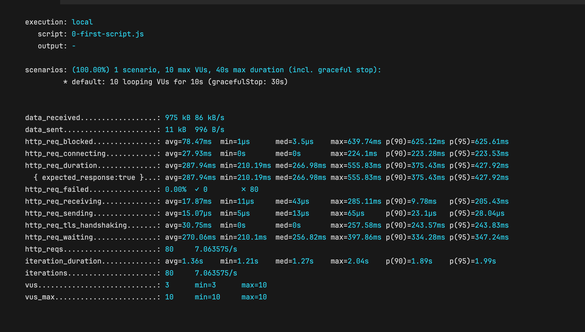

## Basic Performance Testing Concepts

When analyzing a k6 test execution report, it can initially seem overwhelming. To make sense of it, let’s go over some fundamental concepts that are key to understanding performance testing with k6.

## Virtual Users (VUs)

In performance testing, virtual users (VUs) simulate real users interacting with your application. They are not actual people, but rather automated scripts that mimic user behavior to test the system’s ability to handle traffic. For example, if you own a shop, each customer entering the shop represents a user visiting your website. If 100 customers come in at the same time, it represents a higher load, which your system must be prepared to handle. Virtual users are like robots simulating these real-world interactions to test how well your website or application performs under stress.

## Requests

A request is an action made by a user (or virtual user) to retrieve information or perform an action on a website. When you browse a website, every interaction—such as clicking on an image or playing a video—results in a request to the server. These requests fetch the necessary data (images, videos, text, etc.) to display the page or perform the desired function. In performance testing, understanding how many requests are made and how long they take is crucial to assessing the efficiency of a system.

## Latency

Latency refers to the delay between making a request and receiving a response. In the context of performance testing, low latency is desirable as it indicates faster response times, which leads to a better user experience. Think of latency like the time it takes for a shopkeeper to fulfill a customer’s request. The shorter the wait, the happier the customer. In the digital world, latency is typically measured through the **HTTP request duration** metric. Lower latency results in faster websites, while higher latency can lead to user frustration due to longer load times.

## Throughput

Throughput represents the number of requests a website can handle within a specific time frame. It’s a key metric that measures the system’s capacity to manage multiple users or requests simultaneously. For example, if a shopkeeper can serve 100 customers per hour, that’s the throughput of the shop. In the digital world, high throughput means a website can handle a large volume of requests efficiently, while low throughput may result in slowdowns or crashes when many users access the site simultaneously. In k6, throughput isn't always provided directly but can be inferred from other metrics.

## Iterations

Iterations refer to the repeated execution of a specific set of actions during a test. In k6, each time a virtual user performs the same task (e.g., logging into a website or completing a purchase), it counts as an iteration. Iterations help assess how a system handles repeated actions over time, providing insights into performance under sustained or repetitive use. By running multiple iterations, you can simulate different load scenarios and evaluate the robustness of your application.